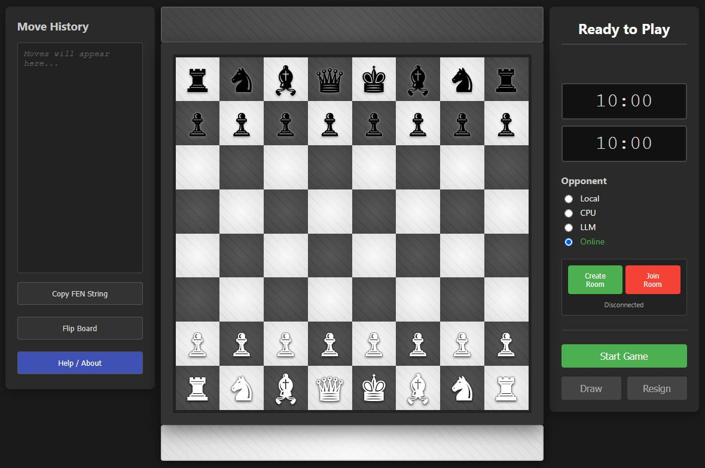

# Node.js Open Chess (v5.1.0)



> [!TIP]  
> **Give it a try: https://chess.internode.info/**

A feature-rich, containerized, and modular Chess application built with Node.js, Socket.io, and Vanilla JavaScript. This project features a polished "Marble" UI, drag-and-drop mechanics, real-time multiplayer, and advanced AI integration allowing you to play against Local CPU or Large Language Models (LLMs) via API.

---

## 🔒 Security & Privacy: API Keys

**Your privacy is paramount.**

*   **Local Storage:** API keys (for OpenAI, Ollama, etc.) are stored **exclusively in your browser's LocalStorage**.
*   **Client-Side Only:** When playing against an LLM, your API key is sent directly from your browser to the API endpoint you defined.
*   **No Server Logging:** The Node.js server that powers the multiplayer aspect of this game **never** receives, sees, or logs your API keys.
*   **Zero-Knowledge:** The game server only relays move coordinates between players; it does not process AI credentials.

---

## ✨ Features

### 🎮 Gameplay Mechanics
*   **Complete Ruleset:** Fully implements Castling, En Passant, Pawn Promotion, 50-move rule, and 3-fold repetition.
*   **Touch & Mouse:** Seamless Drag-and-Drop support for desktop mouse and mobile touch screens.
*   **Game States:**
    *   Check / Checkmate detection.
    *   Stalemate and Draw detection.
    *   Interactive Graveyard (captured pieces).
    *   Move History (PGN) and FEN String export.

### 🤖 AI Opponents
1.  **Local CPU (Minimax):**
    *   Runs entirely in the browser (offline capable).
    *   **Algorithms:** Minimax with Alpha-Beta Pruning and Piece-Square Tables.
    *   **Difficulty Levels:**
        *   *Easy:* Greedy capture logic.
        *   *Normal:* Depth 2 search.
        *   *Hard:* Depth 3 search.
        *   *Expert:* Depth 4 search (Heavy calculation).
2.  **LLM Agent (API Integration):**
    *   Play against **Ollama** (local), **OpenAI**, or any OpenAI-compatible endpoint.
    *   **Robustness:** Includes logic to validate LLM moves and auto-retry if the AI suggests an illegal move.
    *   **Fallback:** Automatically switches to Local CPU if the API becomes unreachable.

### 🌐 Multiplayer (P2P)
*   **Real-Time Sockets:** Built on `socket.io` for instant move transmission.
*   **Room System:** Create private rooms and share IDs with friends.
*   **Disconnect Handling:**
    *   Auto-reconnects if the connection drops.
    *   30-second "Disconnect Timer" prevents opponents from stalling by closing the tab.
    *   Spectator support (join a room already in progress).

### 🎨 User Interface
*   **Marble Theme:** High-contrast procedural marble textures.
*   **Visual Feedback:** Highlights for Legal Moves, Last Move, Check, and Selection.
*   **Audio:** Sound effects for moving, capturing, checking, and game over.
*   **Session Restore:** Accidentally refreshed the tab? The game automatically saves your session and prompts you to resume.

---

## 🚀 Installation & Setup

### Prerequisites
*   **Node.js** (v14.0 or higher)
*   **NPM** (Node Package Manager)

### 1. Clone and Install
```bash
git clone https://github.com/your-username/node-marble-chess.git
cd node-marble-chess
npm install
```

### 2. Start the Server
```bash
npm start
```
The application will launch at `http://localhost:3000`.

---

## 🧠 AI Configuration

### Playing against Local LLMs (Ollama)
1.  Ensure [Ollama](https://ollama.com/) is running (`ollama serve`).
2.  Enable CORS on Ollama if necessary (set `OLLAMA_ORIGINS="*"`).
3.  In the game UI, select **LLM**.
4.  **URL:** `http://localhost:11434/api/chat` (or your specific port).
5.  **Model:** Type `llama3:latest` (or your installed model).
6.  **Key:** Leave blank.

### Playing against OpenAI
1.  In the game UI, select **LLM**.
2.  **URL:** `https://api.openai.com/v1/chat/completions`.
3.  **Model:** `gpt-3.5-turbo` or `gpt-4`.
4.  **Key:** Enter your Bearer Token (`sk-...`).

---

## 📂 Project Structure

*   **`index.html`**: Main entry point and layout structure.
*   **`css/style.css`**: Styling, grid layout, and marble textures.
*   **`js/game.js`**: Core Chess engine (Move validation, FEN, Game loop).
*   **`js/ui.js`**: DOM manipulation, drag-and-drop handlers, board rendering.
*   **`js/network.js`**: Socket.io client wrapper for multiplayer.
*   **`js/opponent.js`**: Local Minimax AI logic.
*   **`js/llm-player.js`**: Integration layer for communicating with LLM APIs.
*   **`js/storage.js`**: Handles saving/loading settings and sessions to `localStorage`.
*   **`server.js`**: (Assuming existence) Node.js/Socket.io backend.

---

## 🛠️ Configuration Options

| Setting | Location | Description |
| :--- | :--- | :--- |
| **Opponent Mode** | Sidebar | Switch between Local (Hotseat), CPU, LLM, or Online. |
| **CPU Level** | Sidebar | Adjust depth of the Minimax algorithm. |
| **Board Flip** | Sidebar | Rotates board 180 degrees. |
| **Copy FEN** | Sidebar | Copies current board state to clipboard. |

---

## 📝 License

This project is open-source. Feel free to modify and distribute.
